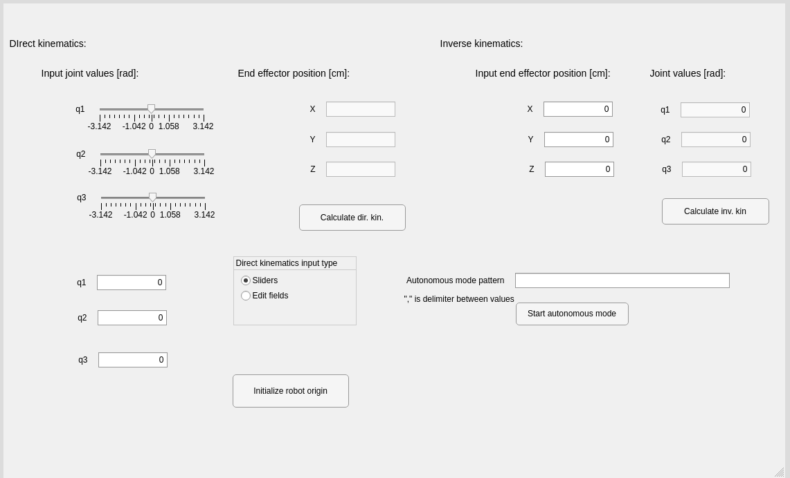

# Robotics practicum project: Robot Builder - Building walls with robots

### Task of this project was to design RRR robot that will collect bricks and drop them at position of black tape utilizing camera and image processing. 

## Manual mode

Setting joint values, either by slider or input box, you can calculate direct kinematics, it will move robot's joints and display position of the end effector using those joint values.

Setting end effector position, it will calculate inverse kinematics and move robot's end effector to that position using joint values from the inverse kinematics, also joint values will be displayed.

## Autonomous mode

Robot and camera first need to be calibrated using *Initialize robot origin* button. Brick colors are put in *Autonomous mode pattern* input box in order that they will be fetched and dropped off. Robot gets video stream from the camera, based on the color of the brick, does image segmentation by color, calculates brick's centroid and converts it to the world frame, then calculates inverse kinematics from which it gets needed joint values to fetch the brick. After fetching the brick, it goes to its neutral pose from where it calculates the centroid of the black tape. As before, calculates inverse kinematics and "drops" brick at the black tape. It continues untill all bricks are dropped off.

## Display of GUI

## Video

[Autonomous mode preview](https://youtu.be/n05sZntGx_I)
